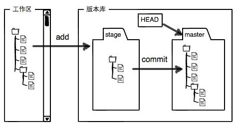
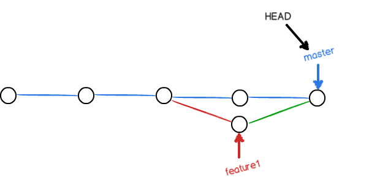
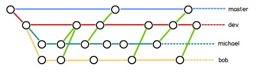
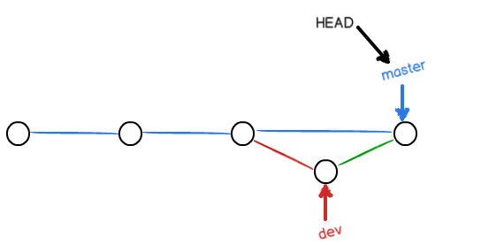
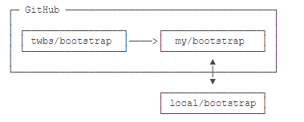

[廖雪峰git学习笔记]([https://www.liaoxuefeng.com/wiki/896043488029600](https://www.liaoxuefeng.com/wiki/896043488029600))
### 时光穿梭机
windows中直接下载git，git bash here即可打开命令行。
修改名字和邮箱。提交更改的负责人。
git --global user.name "xxx"
git --global user.email "xxx@xx.com"
cd到指定的文件目录（本地的项目）。
git init。即可初始化一个仓库，多了.git文件，不要动。
然后在目录下添加文件readme.txt。
git add readme.txt 将文件加入暂存区。
git commit -m "add readme.txt" 添加此次更改的备注，并且将暂存区中的文件提交到本地的master。
git status 只是查看工作区的状态，工作区是否修改了文件，或者添加了新文件与否。并不知道修改了什么。git的核心在于暂存区和分支（master），这里创建了文件的备份。
git diff 查看工作区文件和暂存区文件的区别（暂存区是上次git add的内容）
git diff --cached 查看暂存区的文件和仓库分支里的内容（上次git commit后的内容）
git diff -HEAD 查看工作区和仓库的差异
git add的反向命令，git checkout 将暂存区最新版本转移到工作区，如果最新版本没有放到暂存区，则回到和版本库一摸一样的状态
git commit的反向命令，git reset HEAD将仓库最新版本转移到暂存区。git reset可以到指定的版本 HEAD^就是上一个版本。HEAD^^,HEAD~100,或者指定commit id。可以通过git reflog查看。git log可以查看命令行未关闭时，这此间的记录，关闭后再开启使用git reflog。
一种我写错了，还没放到暂存区，则直接git checkout，一种是我写错了还git add到暂存区了，则使用git reset重置暂存区，再使用git checkout将暂存区的版本转移到工作区。
git rm test.txt删除暂存区中的文件。通过rm删除本地工作区文件后，造成工作区和暂存区的不匹配。git rm删除暂存区，并不删除工作区和master。所以还需要git commit进行提交。

### 远程仓库
连接远程仓库github。首先要生成ssh公钥和密钥。在c盘usrs下用户名文件夹下查看.ssh文件夹，没有则使用ssh-keygen -t rsa -C "youremail@example.com" ，一路回车。就生成了。找到pub公钥后，在自己的github账号里面add ssh keys，添加上这个公钥即可。这是为了识别这个机器来源是你本人。
git remote add origin git@server-name:path/repo-name.git 只能关联一次，我使用的是https方式关联。
关联后，使用命令git push -u origin master第一次推送master分支上所有的内容
之后只需要使用 git push origin master，推送最新的更改。没有网络也可以进行工作，有网络的时候再把本地提交推送一下就可以完成同步。

当我们从零开始时，最好是先在远程仓库创建，再使用git clone拉到本地仓库。最好使用ssh协议的，比https快。
git clone git@github.com:TobinZuo/gitskills.com

### 分支管理
git branch 查看分支情况
git branch -d dev删除分支
git checkout -b dev 创建并转到指定分支
git checkout dev转到指定分支
因为git checkout和回退工作区版本混淆，可以使用git switch -c dev创建并转到相应分支。
git branch dev 创建分支
git merge dev将某分支合并到当前分支，在master分支下，master指针就指向了dev分支
HEAD不是指向master，只是指向当前分支。在dev分支下，就是指向dev分支。

也有merge不了的情况，同时对txt文件做了修改，内容不一样，则cat read.txt可以看到不一样的地方，手动修改为一样的。
此时再执行git add， git commit就自动合并了。
想要看分支的图示合并情况使用，git log的带参数指令。
git log --graph --pretty=oneline --abbrev-commit
一般团队的工作模式类似这样。平时都在自己的分支下干活，合并到dev分支下。需要发布新版本则合并到master分支下。

合并分支时，默认方式使用Fast forward模式，就是指针master直接指向dev，但是这样的弊端是，删除分支后，会丢掉被merge的分支信息。
使用git merger --no-ff -m "merge with no-ff" dev指令禁用fast forward模式，如下图所示，不再是直接指向了。

Bug分支。想要去bug分支工作，但是手头的工作还没完成怎么办。
git stash 可以保存好现场。再转到其他分支修好bug，回到当前分支。可以看到当前分支保留了哪些现场。git stash list。
git stash apply可以恢复，但是stash不删除，使用git stash drop删除。最好使用git stash pop，恢复的同时也把stash内容也删除了。
当在另一个分支上做的bug修复，再当前分支上也存在这个bug，可以直接使用git cherry-pick <commit>这是在那个分支上的修复bug的提交id。
开发一个新feature最好新建一个分支，如果要丢弃一个没有被合并过的分支，可以通过git branch -D <name>强行删除。
多人协作的工作模式：
多人协作的工作模式通常是这样：
首先，可以试图用git push origin <branch-name>推送自己的修改；
如果推送失败，则因为远程分支比你的本地更新，需要先用git pull试图合并；
如果合并有冲突，则解决冲突，并在本地提交；
没有冲突或者解决掉冲突后，再用git push origin <branch-name>推送就能成功！
如果git pull提示no tracking information，则说明本地分支和远程分支的链接关系没有创建，用命令git branch --set-upstream-to <branch-name> origin/<branch-name>。
这就是多人协作的工作模式，一旦熟悉了，就非常简单。
查看远程库信息，使用git remote -v；本地新建的分支如果不推送到远程，对其他人就是不可见的；从本地推送分支，使用git push origin branch-name，如果推送失败，先用git pull抓取远程的新提交；在本地创建和远程分支对应的分支，使用git checkout -b branch-name origin/branch-name，本地和远程分支的名称最好一致；建立本地分支和远程分支的关联，使用git branch --set-upstream branch-name origin/branch-name从远程抓取分支，使用git pull，git pull相当于git fetch+git merger，如果有冲突，要先处理冲突，处理完冲突后自动合并。
git rebase可以将未提交的分支调整为一条直线。
### 标签管理
因为commit id很难记，所以可以进行标签管理，使用版本号更好记。
git tag v1.0，默认打上最近的commit的版本，即HEAD，如果要对之前的打标签，则git log找到历史记录的commit id，git tag v0.9 fxxxxxx
使用git tag可以查看标签。
git show v0.9查看详细信息。
git tag -a v0.1 -m "version 0.1 released" 1094adb。-a标签名，-m描述信息。
标签和commit id挂钩。
推送标签，git push origin <tagname>
推送全部未推送过的本地标签，git push origin --tags 
删除本地标签 git tag -d<tagname>可以删除一个本地标签
命令git push origin :refs/tags/<tagname>可以删除一个远程标签 
### 使用github

可以推送pull requests给官方仓库来贡献代码
.gitignore文件本身要放到版本库里，并且可以对.gitignore做版本管理。

关于git的一些配置和图形界面软件SourceTree没有做笔记。

